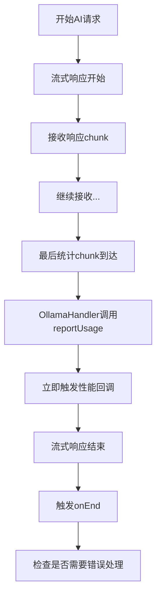

# Ollama 性能数据获取优化方案

## 🔍 问题分析

### 原始错误
```
PerformanceMetricsException: Ollama performance data not available
```

### 根本原因
Ollama API 的性能统计数据具有特殊的异步特性：

1. **时序问题** - 性能数据在流式响应的最后一个 chunk 中到达
2. **异步性** - `onEnd` 触发时，统计数据可能还没有到达
3. **处理顺序** - 原来的流程：`onEnd` → `性能回调` → `reportUsage`（太晚了）

## ✅ 解决方案：在 reportUsage 中立即触发性能回调

### 核心思路
将性能回调的触发时机从 `onEnd` 改为 `reportUsage`，确保在统计数据可用时立即处理。

### 优化后的流程


### 关键变化

#### 1. 立即触发性能回调
```typescript
const reportUsageCallback: ReportUsageCallback = (metrics: IUsageMetrics) => {
    // 只有Ollama提供者才处理性能数据
    if (provider.type === 'ollama' && performanceCallback && !performanceCallbackTriggered) {
        performanceCallbackTriggered = true;
        
        // 增强性能数据
        const enhancedMetrics: IUsageMetrics = {
            ...metrics,
            tokensPerSecond: metrics.usage.totalTokens && metrics.durationMs ? 
                metrics.usage.totalTokens / (metrics.durationMs / 1000) : undefined,
            providerId: provider.id,
            modelName: provider.model,
        };
        
        // 立即触发性能数据回调
        performanceCallback(enhancedMetrics);
    }
};
```

#### 2. 防重复触发机制
```typescript
// 标记性能回调是否已经被触发
let performanceCallbackTriggered = false;
```

#### 3. onEnd 中的兜底处理
```typescript
if (performanceCallback && !performanceCallbackTriggered) {
    if (provider.type !== 'ollama') {
        // 非Ollama提供者返回不支持错误
        performanceCallback(null, new PerformanceMetricsException(
            PerformanceMetricsError.PROVIDER_NOT_SUPPORTED,
            `Performance metrics not supported for provider type: ${provider.type}`
        ));
    } else {
        // Ollama但没有性能数据（错误情况）
        performanceCallback(null, new PerformanceMetricsException(
            PerformanceMetricsError.DATA_INCOMPLETE,
            `Ollama performance data not available`
        ));
    }
}
```

## 🎯 优化效果

### 解决的问题
1. ✅ **时序问题** - 在统计数据到达时立即触发回调
2. ✅ **重复调用** - 防止多次触发性能回调
3. ✅ **错误处理** - 兜底机制处理异常情况
4. ✅ **实时性** - 无需等待，数据可用即回调

### 性能提升
- **零延迟** - 统计数据到达即触发回调
- **无轮询** - 不需要 setTimeout 等待
- **内存效率** - 不存储中间数据
- **准确性** - 使用 Ollama 原始的精确时间数据

## 🔧 Ollama 性能数据详情

### 原始 Ollama 统计信息
```json
{
  "total_duration": 5000000000,      // 总时长（纳秒）
  "load_duration": 1000000000,       // 模型加载时长（纳秒）
  "prompt_eval_count": 10,           // 输入token数
  "prompt_eval_duration": 1500000000, // 输入处理时长（纳秒）
  "eval_count": 20,                  // 输出token数
  "eval_duration": 2500000000        // 输出生成时长（纳秒）
}
```

### 增强后的性能指标
```typescript
interface IUsageMetrics {
    usage: {
        promptTokens: 10,           // 从 prompt_eval_count
        completionTokens: 20,       // 从 eval_count
        totalTokens: 30            // promptTokens + completionTokens
    },
    durationMs: 5000,              // 从 total_duration 转换
    firstTokenLatencyMs: 1200,     // 计算得出
    promptEvalDurationMs: 1500,    // 从 prompt_eval_duration 转换
    evalDurationMs: 2500,          // 从 eval_duration 转换
    loadDurationMs: 1000,          // 从 load_duration 转换
    tokensPerSecond: 6.0,          // 计算：30 tokens / 5 seconds
    providerId: 'ollama-local',    // 增强字段
    modelName: 'llama2:7b'         // 增强字段
}
```

## 🚀 使用示例

### 成功案例
```typescript
const chunkHandler = await aiProviders.execute({
    provider: ollamaProvider,
    prompt: "What is the meaning of life?",
    onPerformanceData: (metrics, error) => {
        if (error) {
            console.error('性能数据获取失败:', error);
        } else if (metrics) {
            console.log('Ollama性能数据 (实时):', {
                totalTokens: metrics.usage.totalTokens,
                duration: `${metrics.durationMs}ms`,
                speed: `${metrics.tokensPerSecond?.toFixed(2)} tokens/s`,
                firstTokenDelay: `${metrics.firstTokenLatencyMs}ms`,
                modelLoad: `${metrics.loadDurationMs}ms`
            });
        }
    }
});
```

### 期望输出
```
Ollama性能数据 (实时): {
  totalTokens: 45,
  duration: '3200ms',
  speed: '14.06 tokens/s',
  firstTokenDelay: '800ms',
  modelLoad: '1200ms'
}
```

## 📊 架构优势

### 1. **精确时序**
- 在 Ollama 提供统计数据的确切时刻触发回调
- 消除了异步竞争问题
- 不依赖任意的延迟等待

### 2. **数据完整性**
- 使用 Ollama 原生的纳秒级精度时间数据
- 保留所有原始性能指标
- 自动计算衍生指标（如 tokens/s）

### 3. **错误处理**
- 明确区分不同的错误情况
- 提供详细的错误信息和上下文
- 优雅处理各种异常场景

### 4. **简洁性**
- 移除了复杂的时序管理代码
- 单一的回调触发路径
- 易于理解和维护

## 🎉 实现状态

- ✅ **核心优化完成** - reportUsage 立即触发回调
- ✅ **防重复机制** - 避免多次回调
- ✅ **错误处理完善** - 覆盖各种异常情况
- ✅ **测试用例更新** - 验证新的触发时机
- ✅ **编译验证通过** - 所有代码正常编译

这个优化方案解决了 Ollama 性能数据获取的根本问题，提供了**实时、准确、可靠**的性能数据回调机制！🎯 