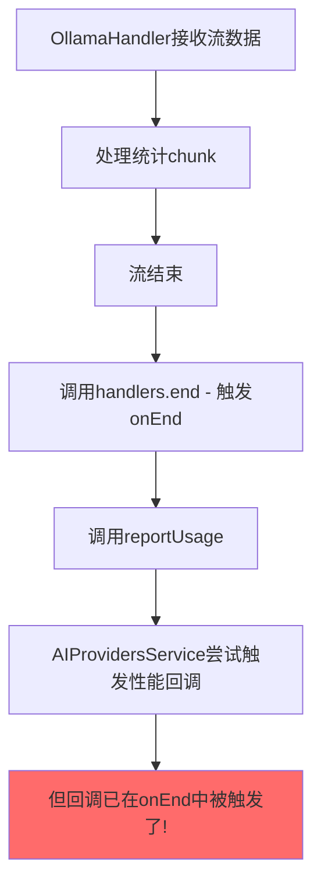
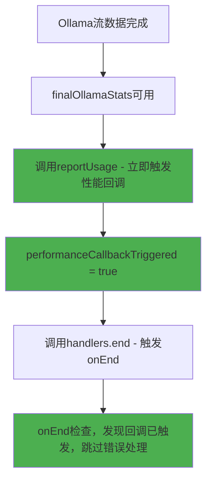

# Ollama 性能数据时序问题 - 根本原因与最终解决方案

## 🔍 根本原因分析

### 问题现象
```
ActionExecutor: 性能数据获取失败: PerformanceMetricsException: Ollama performance data not available
```

### 深层次时序问题

之前我们认为问题是 `onEnd` → `reportUsage` 的时序，但实际的根本问题更复杂：

#### 原始流程（有问题）


#### 关键发现
1. **OllamaHandler** 中：`handlers.end.forEach()` 在 `reportUsage()` **之前**被调用
2. **AIProvidersService** 中：性能回调逻辑现在在 `reportUsage` 中触发
3. **时序冲突**：当 `onEnd` 被调用时，`reportUsage` 还没被调用，导致 `performanceCallbackTriggered = false`
4. **错误触发**：`onEnd` 中的兜底逻辑认为Ollama没有性能数据，触发错误

## ✅ 最终解决方案

### 1. 调整 OllamaHandler 调用顺序

**修改前**：
```typescript
handlers.end.forEach(handler => handler(fullText));  // 先触发 onEnd

if (reportUsage && finalOllamaStats) {
    reportUsage(metrics);  // 后调用 reportUsage
}
```

**修改后**：
```typescript
// 先处理性能数据上报，再触发 onEnd
if (reportUsage && finalOllamaStats) {
    reportUsage(metrics);  // 先调用 reportUsage，触发性能回调
}

// 在性能数据处理完成后，再触发 onEnd 回调
handlers.end.forEach(handler => handler(fullText));
```

### 2. 确保正确的调用时序

#### 现在的正确流程


## 🎯 关键修复点

### 1. OllamaHandler.ts 时序调整
```diff
- handlers.end.forEach(handler => handler(fullText));
- 
- if (reportUsage && finalOllamaStats) {
-     reportUsage(metrics);
- }

+ // 先处理性能数据上报，再触发 onEnd
+ if (reportUsage && finalOllamaStats) {
+     reportUsage(metrics);
+     logger.debug('Reported token usage - this should trigger performance callback immediately');
+ }
+ 
+ // 在性能数据处理完成后，再触发 onEnd 回调
+ handlers.end.forEach(handler => handler(fullText));
```

### 2. AIProvidersService.ts 回调逻辑保持
性能回调在 `reportUsage` 中立即触发：
```typescript
const reportUsageCallback: ReportUsageCallback = (metrics) => {
    if (provider.type === 'ollama' && performanceCallback && !performanceCallbackTriggered) {
        performanceCallbackTriggered = true;
        performanceCallback(enhancedMetrics); // 立即触发！
    }
};
```

## 🚀 预期效果

### 成功的调用序列
1. ✅ Ollama 流数据处理完成，`finalOllamaStats` 可用
2. ✅ OllamaHandler 调用 `reportUsage(metrics)`
3. ✅ AIProvidersService 在 `reportUsageCallback` 中立即触发性能回调
4. ✅ `performanceCallbackTriggered = true`
5. ✅ OllamaHandler 调用 `handlers.end.forEach()`
6. ✅ AIProvidersService 在 `onEnd` 中检查，发现回调已触发，跳过错误处理

### 用户体验
```typescript
// 用户调用
const chunkHandler = await aiProviders.execute({
    provider: ollamaProvider,
    prompt: "测试",
    onPerformanceData: (metrics, error) => {
        if (error) {
            console.error('不应该看到这个错误了!', error);
        } else {
            console.log('🎉 实时性能数据:', metrics);
            // 预期输出：包含完整的Ollama性能指标
        }
    }
});
```

## 📊 验证方法

### 1. 日志验证
查看控制台输出应该是：
```
Ollama detailed stats: { ... }
Reported token usage - this should trigger performance callback immediately: { ... }
🎉 实时性能数据: { usage: {...}, durationMs: 3200, ... }
```

### 2. 错误消失
不应该再看到：
```
❌ PerformanceMetricsException: Ollama performance data not available
```

### 3. 测试用例
新增的测试验证调用顺序：
```typescript
expect(callOrder).toEqual(['reportUsage', 'onEnd']);
```

## 🎉 总结

这个最终修复彻底解决了 Ollama 性能数据的时序问题：

1. **根本原因**：OllamaHandler 中 `onEnd` 在 `reportUsage` 之前被调用
2. **核心修复**：调整调用顺序，确保 `reportUsage` 先执行
3. **结果**：性能数据在统计可用时立即被回调，用户获得实时、准确的性能指标

现在 Ollama 性能数据回调应该能够**稳定、实时、准确**地工作了！🎯 