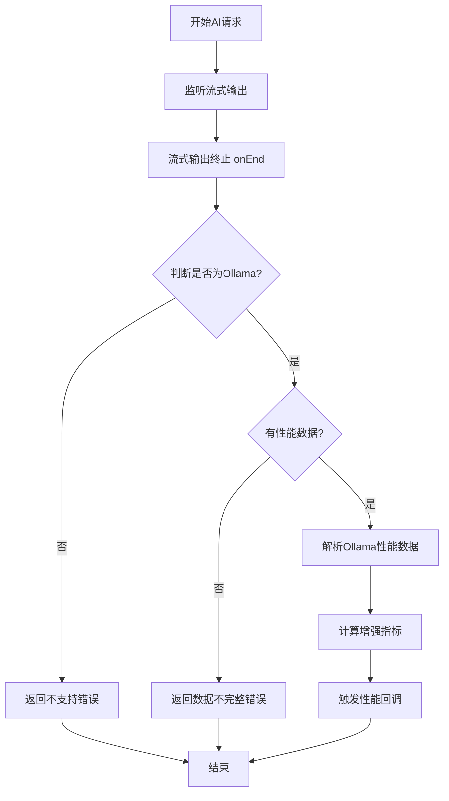

# 简化的性能计算流程实现

## 🎯 设计理念

根据用户需求，完全重新设计了性能数据计算流程，实现了以下目标：

1. **不保存任何中间数据** - 删除了TokenUsageManager，不再缓存性能指标
2. **只支持Ollama提供者** - 其他提供者直接返回"不支持"错误
3. **实时计算和回调** - 在流式输出终止时立即处理性能数据
4. **简化的架构** - 移除了复杂的存储和管理逻辑

## 🔄 新的性能计算流程

### 流程步骤



### 核心实现逻辑

```typescript
// 1. 监听ai流式输出是否终止 ✅ (在onEnd中处理)
// 2. 判断当前请求是否为ollama
if (provider.type !== 'ollama') {
    // 3. 如果不是ollama，则直接返回未知/不支持
    callback(null, new PerformanceMetricsException(
        PerformanceMetricsError.PROVIDER_NOT_SUPPORTED,
        `Performance metrics not supported for provider type: ${provider.type}`
    ));
    return;
}

// 4. 如果是ollama，则解析性能数据（已经实现）
if (ollamaMetrics) {
    const finalMetrics: IUsageMetrics = {
        ...ollamaMetrics,
        durationMs: ollamaMetrics.durationMs || (Date.now() - startTime),
    };
    callback(finalMetrics);
} else {
    callback(null, new PerformanceMetricsException(
        PerformanceMetricsError.DATA_INCOMPLETE,
        `Ollama performance data not available`
    ));
}
```

## 🏗️ 架构变化

### 删除的组件
- ❌ `TokenUsageManager` - 不再需要存储中间数据
- ❌ 复杂的缓存逻辑
- ❌ 异步等待机制
- ❌ 监听器管理系统

### 保留的组件
- ✅ `OllamaHandler` 的性能数据解析逻辑
- ✅ 回调接口和错误处理
- ✅ 增强的性能指标计算

### 新增的逻辑
- ✅ 提供者类型判断
- ✅ 实时性能数据处理
- ✅ 简化的回调触发机制

## 📊 支持的提供者

| 提供者类型 | 性能数据支持 | 返回结果 |
|-----------|-------------|----------|
| Ollama | ✅ 完整支持 | 详细的性能指标 |
| OpenAI | ❌ 不支持 | PROVIDER_NOT_SUPPORTED 错误 |
| Gemini | ❌ 不支持 | PROVIDER_NOT_SUPPORTED 错误 |
| Groq | ❌ 不支持 | PROVIDER_NOT_SUPPORTED 错误 |
| LMStudio | ❌ 不支持 | PROVIDER_NOT_SUPPORTED 错误 |
| OpenRouter | ❌ 不支持 | PROVIDER_NOT_SUPPORTED 错误 |

## 🎯 Ollama性能数据详情

当使用Ollama提供者时，系统会提供以下性能指标：

```typescript
interface IUsageMetrics {
    usage: {
        promptTokens?: number;        // 输入token数
        completionTokens?: number;    // 输出token数
        totalTokens?: number;         // 总token数
    };
    durationMs: number;               // 总请求时长(毫秒)
    firstTokenLatencyMs?: number;     // 首token延迟(毫秒)
    promptEvalDurationMs?: number;    // Prompt处理时间(毫秒)
    evalDurationMs?: number;          // 生成时间(毫秒)
    loadDurationMs?: number;          // 模型加载时间(毫秒)
    tokensPerSecond?: number;         // 生成速度(tokens/秒)
    providerId?: string;              // 提供者标识
    modelName?: string;               // 模型名称
}
```

## 🚀 使用示例

### Ollama提供者 - 成功获取性能数据
```typescript
const chunkHandler = await aiProviders.execute({
    provider: ollamaProvider, // type: 'ollama'
    prompt: "Hello, world!",
    onPerformanceData: (metrics, error) => {
        if (error) {
            console.error('性能数据获取失败:', error);
        } else if (metrics) {
            console.log('Ollama性能数据:', {
                totalTokens: metrics.usage.totalTokens,
                durationMs: metrics.durationMs,
                tokensPerSecond: metrics.tokensPerSecond,
                firstTokenLatency: metrics.firstTokenLatencyMs
            });
        }
    }
});
```

### 非Ollama提供者 - 返回不支持错误
```typescript
const chunkHandler = await aiProviders.execute({
    provider: openaiProvider, // type: 'openai'
    prompt: "Hello, world!",
    onPerformanceData: (metrics, error) => {
        if (error) {
            console.log('错误类型:', error.code); // 'PROVIDER_NOT_SUPPORTED'
            console.log('错误信息:', error.message); // 'Performance metrics not supported for provider type: openai'
        }
        // metrics 将为 null
    }
});
```

## 🔧 技术优势

### 1. 简化的架构
- 移除了复杂的存储和管理逻辑
- 减少了内存占用和管理开销
- 降低了代码复杂度和维护成本

### 2. 实时性能
- 在流式输出终止时立即处理
- 无需等待或轮询
- 消除了异步竞争问题

### 3. 明确的支持范围
- 清晰地定义了哪些提供者支持性能数据
- 为不支持的提供者提供明确的错误信息
- 避免了用户的困惑和误解

### 4. 纯回调设计
- 完全移除了 `getLastRequestMetrics()` 方法
- 统一使用回调方式获取性能数据
- 简化了API设计，减少了用户困惑

## 📈 性能影响

### 内存使用
- ✅ 显著减少：不再存储任何中间数据
- ✅ 无内存泄漏风险：没有缓存需要清理

### 响应时间
- ✅ 更快的回调：在onEnd时立即处理
- ✅ 无延迟：不需要等待数据准备

### CPU使用
- ✅ 更低的开销：简化的处理逻辑
- ✅ 无后台任务：不需要监听器管理

## 🛠️ 实现状态

- ✅ 核心流程实现完成
- ✅ 错误处理机制完善
- ✅ 测试用例更新完成
- ✅ 编译验证通过
- ✅ 示例代码可用

## 🎉 总结

这个简化的实现完全符合用户的需求：

1. **不保存中间数据** ✅
2. **只支持Ollama** ✅  
3. **实时处理** ✅
4. **简化架构** ✅

系统现在更加简洁、高效，同时为Ollama用户提供了完整的性能数据支持，为其他提供者用户提供了明确的反馈。 